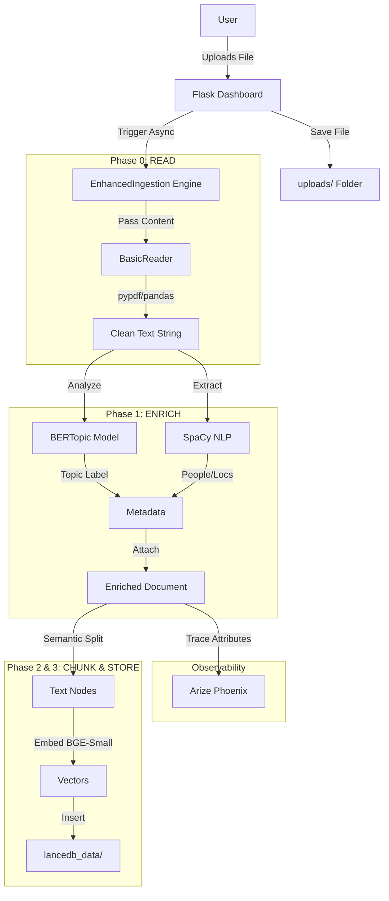

# Phoenix Ingestion Pipeline: Deep Dive

This document details the end-to-end flow of the Phoenix Ingestion Pipeline, explaining how files travel from upload to being indexed in LanceDB, and how the various software components interact.

## 1. High-Level Architecture

The pipeline follows a strict **3-Phase Ingestion Process**:
1.  **READ**: Parse binary/text files into a standard string format.
2.  **ENRICH**: Extract semantic metadata (Topics, Entities) using AI models.
3.  **STORE**: Chunk the content, embed it, and save it to the Vector Database.

All of this is observable via **Arize Phoenix**.


## 2. Step-by-Step Data Flow

### Step 1: User Upload (The Entry Point)
*   **User Action**: Drag & Drop a file (PDF, CSV, Excel, TXT, etc.) onto the Dashboard.
*   **Endpoint**: `POST /upload`
*   **Component**: `pheonix_dashboard.py`
    *   Saves the raw file to `uploads/`.
    *   Triggers the ingestion engine asynchronously.

### Step 2: Protocol Reading (Phase 0)
*   **Component**: `ingestion_core.py` -> `components.reader.BasicReader`
*   **Action**:
    *   The raw file content is encoded into a `FileConfig` object.
    *   `BasicReader` detects the file extension (.pdf, .xlsx, .csv, etc.).
    *   **Transformation**:
        *   **PDF**: Uses `pypdf` to extract text from pages.
        *   **Excel/CSV**: Uses `pandas/openpyxl` to convert rows into a readable markdown-like table format.
        *   **Text/Code**: Reads as UTF-8.
    *   **Result**: A unified clean text string representing the document.

### Step 3: Semantic Enrichment (Phase 1)
*   **Component**: `ingestion_core.py` -> `EnhancedIngestion.process_document`
*   **Action**: The clean text is passed through two analysis models.
    1.  **Topic Modeling (BERTopic)**:
        *   Fits/Transforms the text to find a cluster (e.g., `politics`).
        *   Labels the document with a high-level topic.
    2.  **Entity Extraction (SpaCy - `en_core_web_sm`)**:
        *   Scans the text for `PERSON`, `DATE`, `GPE` (Location).
        *   Extracts unique entities.
    *   **Result**: A `Document` object with metadata:
        ```json
        {
          "filename": "report.pdf",
          "topic": "finance_q4",
          "entities_people": "Elon Musk, Tim Cook",
          "entities_locations": "California, Texas"
        }

### Step 4: Observability Trace
*   **Component**: `phoenix` (OpenTelemetry)
*   **Action**: Before chunking, the system logs a "Trace" to Arize Phoenix.
    *   The discovered topic and entity counts are sent as attributes.
    *   This allows you to verify *what* was ingested in the Phoenix UI.

### Step 5: Chunking & Embedding (Phase 2)
*   **Component**: `LlamaIndex` (`SemanticSplitterNodeParser`)
*   **Action**:
    *   **Splitting**: Instead of arbitrary 500-word chunks, the parser uses embeddings to find "semantic breaks" in the text (natural execution points).
    *   **Embedding**: Each chunk is converted into a vector (384-dimensional) using `BAAI/bge-small-en-v1.5`.

### Step 6: Storage (Phase 3)
*   **Component**: `LanceDBVectorStore`
*   **Action**:
    *   The chunk nodes + vectors + metadata are inserted into the `vectors` table in local LanceDB.
    *   If the table doesn't exist (Cold Start), it works seamlessly due to the robust `init_system` check.


## 3. Mermaid Diagram




## 4. Component Software Table

| Component | Software / Library | Role |
| :--- | :--- | :--- |
| **Orchestrator** | `Flask` | Hosted the web server, handles routes, and manages the lifecycle. |
| **Reader** | `pypdf`, `pandas`, `openpyxl`, `python-docx` | Converts binary formats (PDF, Excel) into plain text for the LLM. |
| **Topic Modeler** | `BERTopic` | Unsupervised learning to label the "theme" of the document automatically. |
| **Entity Extractor** | `SpaCy` | Extracts specific proper nouns (People, Places, Dates) for better search filtering. |
| **Embedder** | `HuggingFace (BGE-Small)` | Converts text to numbers (Vectors) so valid semantic search is possible. |
| **Database** | `LanceDB` | A serverless vector database that stores the vectors and allows fast retrieval. |
| **Framework** | `LlamaIndex` | The glue code that manages nodes, splitters, and vector store interactions. |
| **Monitor** | `Arize Phoenix` | Provides a dashboard to see traces, latencies, and what metadata was extracted. |

---

## 5. Directory Structure Explanation

```text
pheonix_ingestion/
├── components/          <-- ISOLATED TOOLKIT (Borrowed from parent)
│   ├── reader/
│   │   └── BasicReader.py  <-- The "Swiss Army Knife" for file reading
│   ├── chunker/
│   │   └── TokenChunker.py <-- Backup chunker (Semantic is main)
│   ├── interfaces.py       <-- Abstract base classes
│   ├── document.py         <-- Standard Document container
│   └── types.py            <-- Shared types
├── server/              <-- SUPPORTING TYPES
│   └── types.py            <-- Defines FileConfig (glue between Flask & Reader)
├── scripts/             <-- UTILITY SCRIPTS
│   └── reingest_all.py     <-- The "Big Red Button" to reset everything
├── lancedb_data/        <-- STORAGE (The actual Database files)
├── uploads/             <-- STAGING (Raw user files)
├── ingestion_core.py    <-- THE BRAIN (Enrichment & Pipeline Logic)
├── pheonix_dashboard.py <-- THE FACE (Web UI & API & Init Logic)
├── rag_engine.py        <-- THE SEARCH (Query Logic)
└── requirements.txt     <-- DEPENDENCIES
```
